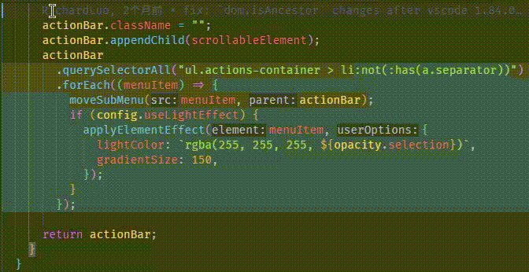
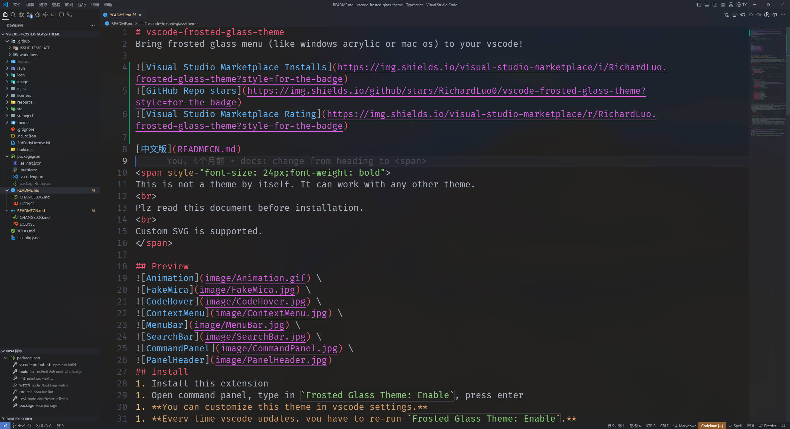
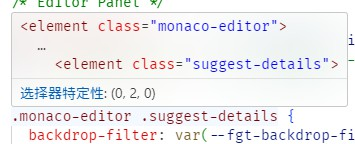
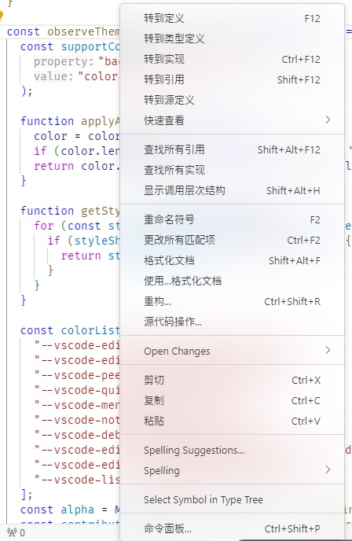
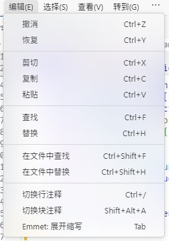
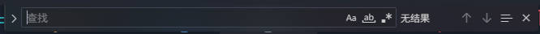
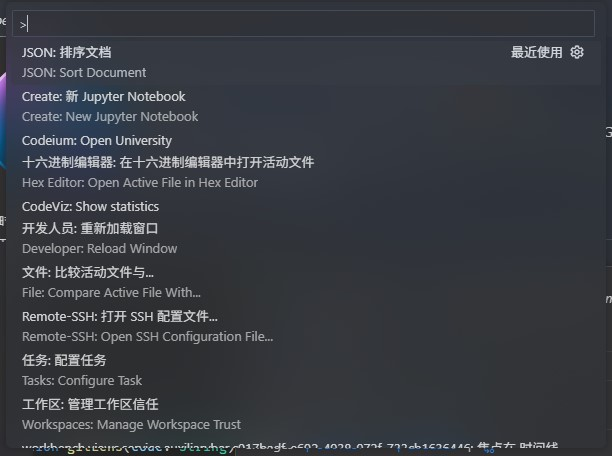
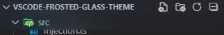

# Frosted Glass Theme
An enhancement to vscode appearance. Major feature includes acrylic effect, mica background, reveal effect, flip effect, animations and more! Fully customizable. Designed to be compatible with other color themes.


[中文版](READMECN.md)

<span style="font-size: 24px;font-weight: bold">
This is a intrusive theme. Can work with any other color themes.
<br>
Plz read this document before installation.
<br>
Custom SVG is supported.
</span>

## Preview
 \
 \
 \
 \
 \
 \
 \

## Install
1. Install this extension.
1. Open command panel, type in `Frosted Glass Theme: Enable`, press enter.
1. **You can customize this theme in vscode settings.**
1. **Every time vscode updates, you have to re-run `Frosted Glass Theme: Enable`.**

If you want to load this theme with other extension or you prefer to maintain the `workbench.html` yourself, download the whole `inject` directory, then import only the `inject\vscode-frosted-glass-theme.js` (with `type="module"`). Then remove the `<meta http-equiv="Content-Security-Policy" ... />` from `workbench.html` (which blocks svg from loading).
### For Linux and perhaps MacOS user
You need to set `window.titleBarStyle` to `custom` to see the effect. Otherwise the effect is very limited.
## Customization
* The opacity settings will blend into theme colors unless they already have opacity.
* `Fake mica` is by default turned off. Enable it with `frosted-glass-theme.fakeMica.enabled` setting. You need to change the theme colors as well since this extension does not apply opacity to your theme automatically. Here is an example:
    ```jsonc
    "workbench.colorCustomizations": {
      "[One Dark Pro]": {
        "menu.selectionBackground": "#ffffff",
        // Title bar opacity not work because: https://github.com/microsoft/vscode/blob/444d7a4b35745ed7733c700a8008f55cd659eb1d/src/vs/workbench/browser/parts/titlebar/titlebarPart.ts#L682
        // "titleBar.activeBackground": "#00000000",  
        "editor.background": "#282c3499",
        "editorGutter.background": "#00000000",
        "editor.lineHighlightBackground": "#2c313c4d",
        "editorPane.background": "#00000000",
        "tab.inactiveBackground": "#00000000",
        "editorGroupHeader.tabsBackground": "#282c34cc",
        "breadcrumb.background": "#00000000",
        "panel.background": "#282c34cc",
        "terminal.background": "#00000000",
        "sideBar.background": "#21252bcc",
        "sideBarTitle.background": "#00000000",
        "statusBar.background": "#21252bcc",
        "statusBar.noFolderBackground": "#21252bcc",
        "input.background": "#1d1f234d",
        "dropdown.background": "#21252bcc",
        "dropdown.border": "#21252b4d",
      },
    }
    ```
    There are more examples in `theme` folder. I welcome everyone to send pull request.
* The `frosted-glass-theme.svg` simply loads svg from a url. The generated svg element is static and only use the css variable from `monaco-workbench`. More svgs can be found in `resource` folder.
* The `frosted-glass-theme.tintSvg` generate different svgs for each key defined in `frosted-glass-theme.filter` and the id on `<filter>` is changed to `id-key`. Inside svg, you can use a special css variable `--fgt-current-background` representing the element's background color.
* The `frosted-glass-theme.filter` settings is a object that represents the filter to use with each element. The key is defined in `src-inject/acrylic.ts`s' `colorVarList`. The value is of the type:
    ```typescript
    type Filter = {
      filter: string;
      disableBackgroundColor: boolean;
      opacity: number;
    };
    type FilterOp = Partial<Filter>;
    const value = string | FilterOp | undefined;
    ```
    The `disableBackgroundColor` disables backgrounds (the filter should provide it). However, `minimap`, `decorationsOverviewRuler` and `terminalOverlay` are based on canvas and draw their own background color, thus you must specify a filter that does not provide a background color for them. \
    There is a special key `default` which acts like a fallback. You can use a special keyword `{key}` to represent the current key. Together with `tintSvg` you can create different color svg for each element. \
    For example, you created a svg that contains a `<filter>` whose `id` is `fgt-acrylic`, and you add it to `tintSvg`. You can then set a value `url(#fgt-acrylic-{key})`, so it will automatically use that element's background color. 
* The `frosted-glass-theme.animation`'s key is defined in `src-inject/animation.ts`'s `selectorMap`, or the key can also be css selector. The value can be either css animation defined in `src-inject/vscode-frosted-glass-theme.css`'s `Animation` or effect defined in `src-inject/effect/effect.ts`'s `effectMap`. However, effects are not affected by css timing function, they are just triggered by `animationstart` event.
* You can add your own effect by calling `window._fgtTheme.registerEffect(key: string, func: (e: Element) => void)`.
* The default config is in `inject/config.json`.
## Uninstall
1. Open command panel, type in "Frosted Glass Theme: Disable", press enter.
1. Uninstall from the extension panel as usual.
## Thanks
* [be5invis/vscode-custom-css](https://github.com/be5invis/vscode-custom-css)
## Disclaimer
This extension modifies `vs\code\electron-sandbox\workbench\workbench.html` to inject files. So use at your own risk. \
Also, the extension keeps a backup in `vs\code\workbench.*.bak-frosted-glass` in case anything goes wrong.
