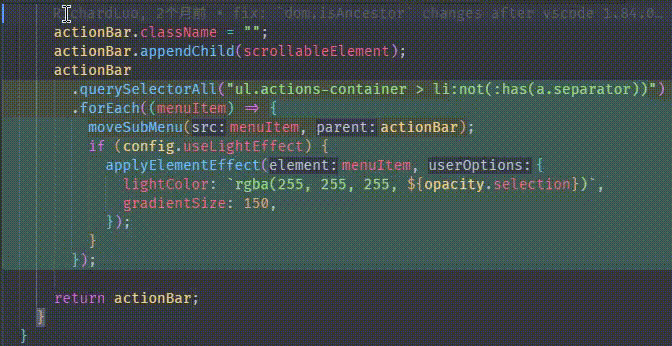
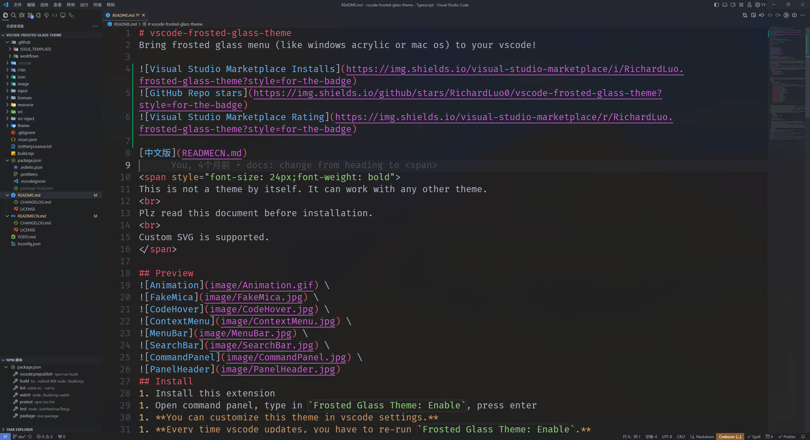
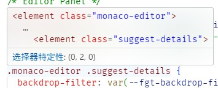
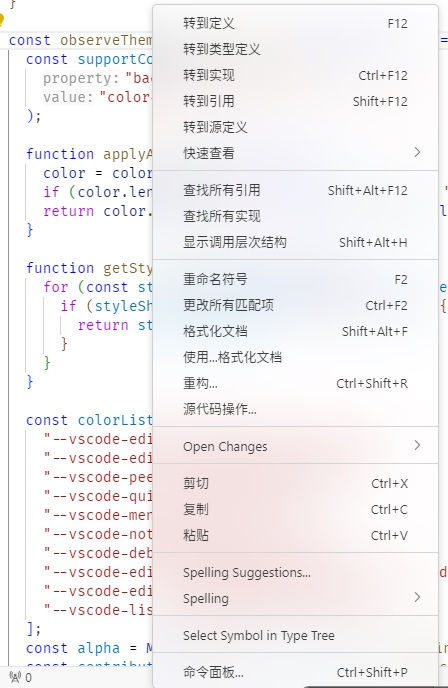
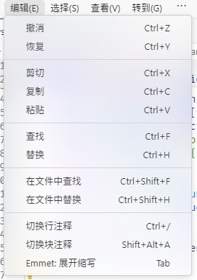
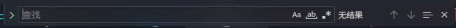
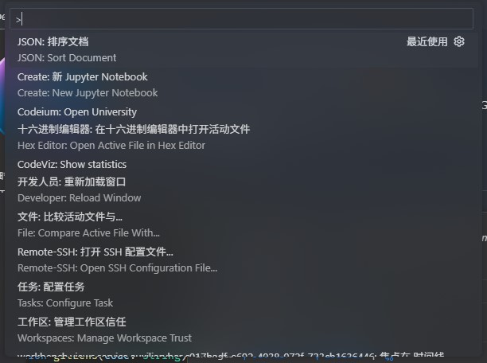
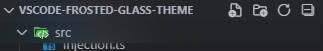

# 毛玻璃主题
对 vscode 外观的全面增强。主要功能包括亚克力效果，云母背景，reveal效果，翻转效果，动画以及更多功能！完全可定制。设计为与其他颜色主题兼容。


[从VSCode市场获取](https://marketplace.visualstudio.com/items?itemName=RichardLuo.frosted-glass-theme)
[从Open-VSX获取](https://open-vsx.org/extension/RichardLuo/frosted-glass-theme)

[English](README.md)

<span style="font-size: 24px;font-weight: bold">
这是一个侵入式主题，它可以与其他颜色主题一起安装。
<br>
安装前请阅读此文档。
<br>
支持自定义SVG。
</span>

## 预览图
[](https://www.youtube.com/watch?v=rpnfE7YDdg4) \
 \
 \
 \
 \
 \
 \
 \

## 安装
1. 安装本扩展。
1. 打开命令面板，输入`Frosted Glass Theme: Enable`，回车。
1. 一些基于 Canvas 的元素可能有自己的背景颜色。因此你必须搞清楚他们的颜色并且给他们加上透明度，然后把他们加回 `workbench.colorCustomizations`。这些颜色是 `"editorOverviewRuler.background", "minimap.background", "terminalStickyScroll.background"`。命令 `frosted-glass-theme.generateThemeMod` 也许能正常工作但是不确定。
1. **你可以在vscode设置中自定义本主题。**
1. **每次vscode更新，你都必须重新运行`Frosted Glass Theme: Enable`。**

如果你想要用其他扩展加载本主题，或者你更喜欢自己维护 `workbench.html` ，下载整个 `inject` 文件夹，然后引入 `inject\vscode-frosted-glass-theme.js` (带上 `type="module"`)。然后移除 `workbench.html` 中的 `<meta http-equiv="Content-Security-Policy" ... />` (它会阻止SVG加载)。如果要使 `Fake mica` 具有移动效果，请在 `Microsoft VS Code/resources/app/out/main.js` 文件的开头导入 `inject/vscode-frosted-glass-theme-main.mjs`。
### 对于Linux和MacOS用户
你需要把 `window.titleBarStyle` 设置为 `custom` 。否则效果很有限。
## 自定义
* 设置中的透明度选项会与主题颜色混合，除非他们已经有透明度了。
* `Fake mica` 默认关闭。开启 `frosted-glass-theme.fakeMica.enabled` 设置以开启此功能。另外因为本扩展不会自动给你的主题添加透明度，你需要同时改变主题颜色，以下是一个示例:
    ```jsonc
    "workbench.colorCustomizations": {
     "[One Dark Pro]": {
        "menu.selectionBackground": "#ffffff",
        // Title bar opacity won't work because: https://github.com/microsoft/vscode/blob/444d7a4b35745ed7733c700a8008f55cd659eb1d/src/vs/workbench/browser/parts/titlebar/titlebarPart.ts#L682
        // "titleBar.activeBackground": "#00000000",  
        "editor.background": "#282c3499",
        "editorGutter.background": "#00000000",
        "editor.lineHighlightBackground": "#2c313c4d",
        "editorPane.background": "#00000000",
        "tab.inactiveBackground": "#00000000",
        "editorGroupHeader.tabsBackground": "#282c34cc",
        "breadcrumb.background": "#00000000",
        "panel.background": "#282c34cc",
        "terminal.background": "#00000000",
        "sideBar.background": "#21252bcc",
        "sideBarTitle.background": "#00000000",
        "statusBar.background": "#21252bcc",
        "statusBar.noFolderBackground": "#21252bcc",
        "input.background": "#1d1f234d",
        "dropdown.background": "#21252bcc",
        "dropdown.border": "#21252b4d",
      },
    }
    ```
    在 `theme` 文件夹中有更多示例，我欢迎大家来发pull request。\
    你也可以试试 `frosted-glass-theme.generateThemeMod` 指令以自动生成一个主题，然后把结果加入到 `colorCustomizations` 中。
* `frosted-glass-theme.svg` 从url中加载一张svg。产生的svg元素是静态的并且只能使用从 `monaco-workbench` 继承的css变量。你可以在 `resource` 文件夹下找到更多svg。
* `frosted-glass-theme.tintSvg` 为 `frosted-glass-theme.filter` 中定义的每一个key产生不同的svg，并且 `<filter>` 上的id被改成了 `id-key`。在svg里，你可以使用一些特殊的css变量: `--fgt-current-background` 代表元素的纯色背景颜色, `--fgt-current-opacity` 代表透明度。
* `frosted-glass-theme.filter` 设置是一个代表每个元素使用的filter的对象。它的key定义在 `src-inject/backdropFilter.ts` 的 `entryList` 中。值类型定义如下：
    ```typescript
    type Filter = {
        filter: string;
        disableBackgroundColor: boolean;
        opacity: number;
    };
    type FilterPart = Partial<Filter>;
    const value = string | FilterPart | undefined;
    ```
    `frosted-glass-theme.disableBackgroundColor` 会关闭元素的背景颜色（filter 应该提供一个颜色）。然而 `minimap` 、`decorationsOverviewRuler` 以及 `terminalOverlay` 基于canvas绘制并且自己提供背景色，因此你必须为他们指定一个无背景色的filter。\
    有一个特殊的key `default`, 相当于一个默认值。你可以使用一个特殊的关键字 `{key}` 来表示当前的key。和 `tintSvg` 一起用，你就可以为每个元素创建不同颜色的svg。\
    比如，你创建了一张svg，其中包含一个 `<filter>` 的 `id` 为 `fgt-acrylic`，并且你把它添加到了 `tintSvg` 中。然后你就可以设置一个值 `url(#fgt-acrylic-{key})`，那么它就会自动使用元素的背景颜色。
* The `frosted-glass-theme.animation` 的key定义在 `src-inject/animation.ts` 的 `selectorMap` 中，或者也可以是css选择器。值可以是定义在 `src-inject/vscode-frosted-glass-theme.css` 的 `Animation` 中的css动画或者定义在 `src-inject/effect/effect.ts` 的 `effectMap` 中的effect。然而，effect不会被css timing function影响，他们只是被 `animationstart` 事件触发。
* 你可以通过调用 `window._fgtTheme.registerEffect(key: string, func: (e: Element) => void)` 添加自己的effect。
* 默认的设定在 `config/config.json` 中。
## 卸载
1. 打开命令面板，输入“Frosted Glass Theme: Disable”，回车。
1. 用扩展面板正常卸载。
1. 如果你想的话，移除 `"workbench.colorCustomizations"`。
## 已知问题
* 从 Windows 24H2 开始, 微软可能改变了壁纸路径。遵循以下步骤： 
  1. 创建硬链接：`cd $env:AppData\Microsoft\Windows\Themes; cmd /c mklink /H .\TranscodedWallpaper.jpg.\TranscodedWallpaper`。
  1. 更改 `frosted-glass-theme.fakeMica.url` 到 `<your user home>/AppData/Roaming/Microsoft/Windows/Themes/TranscodedWallpaper.jpg`.
* 编辑器的字体可能会变细。
* 如果一些颜色不正确，这也许是因为你的主题用了补色+高透明度。比如，Codemos Modern。你可以尝试使用普通模糊滤镜来代替 acrylic.svg：
    ```json
    "frosted-glass-theme.filter": {
      "sideBarSectionHeader": {
        "filter": "blur(30px)",
        "disableBackgroundColor": false
      },
      "slider": {
        "filter": "blur(30px)",
        "disableBackgroundColor": false
      },
    }
    ```
    应用并且重启 vscode. key 定义在 `src-inject/backdropFilter.ts` 的 `entryList` 中。
## 感谢
* [be5invis/vscode-custom-css](https://github.com/be5invis/vscode-custom-css)
## 免责声明
本扩展修改了 `resources\app\out\vs\code\electron-sandbox\workbench\workbench.html` 和 `resources\app\out\main.js` 来注入文件。风险自负。\
本扩展在 `resources\app\out\vs\code\workbench.*.bak-frosted-glass` 和 `resources\app\out\main.*.bak-frosted-glass` 中保留备份，以防出现问题。
