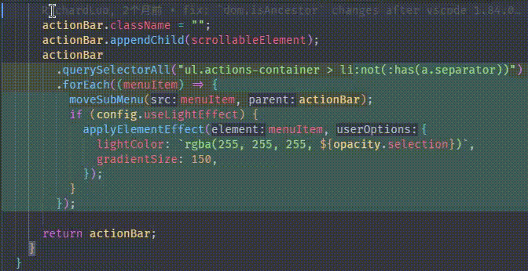
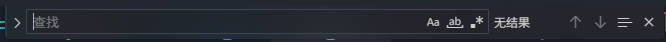
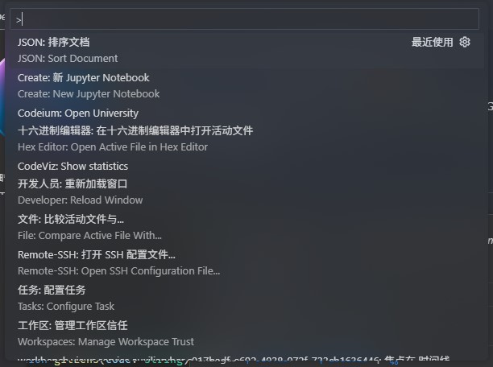

# vscode 毛玻璃主题
为你的vscode带来类似Mac OS或是Windows的acrylic material效果的菜单！

[English](README.md)

<span style="font-size: 24px;font-weight: bold">
这本身不是一个主题，它可以与其他主题一起安装
<br>
安装前请阅读此文档
</span>

## 预览图
 \
 \
 \
 \
 \
 \

## 安装
* 从vscode拓展商店搜索Frosted Glass Theme安装
* 打开命令面板，输入`Frosted Glass Theme: Enable`，回车
* **你可以在vscode设置中自定义本主题。**
* **每次vscode更新，你都必须重新运行`Frosted Glass Theme: Enable`。**
* 菜单颜色由`menu.background`控制。Reveal effect 颜色由`menu.selectionBackground`控制（我建议使用 #000000 或者 #ffffff）。在本拓展设置中的透明度选项会被直接应用在这些颜色上。我建议如果有需要改变颜色，使用类似以下的格式。
  ```json
  "workbench.colorCustomizations": {
    "[Default Dark Modern]": {
        "menu.selectionBackground": "#ffffff",
        "menu.background": "#000000"
    },
  }
  ```
* 如果你想要用另一个拓展加载本主题，或者你更喜欢自己维护`workbench.html`，你只需要引入`inject\vscode-frosted-glass-theme.js` (设定为`type="module"`)。另外，`inject\vscode-frosted-glass-theme.css`必须放在js文件旁边。
### 对于Linux和MacOS用户
你需要把 `window.titleBarStyle` 设置为 `custom` 。否则效果很有限。
## 卸载
* 打开命令面板，输入“Frosted Glass Theme: Disable”，回车
* 用拓展面板正常卸载
## 已知问题
* 如果动画闪烁，尝试设置 `frosted-glass-theme.animation` 为 `none`
## 感谢
* [be5invis/vscode-custom-css](https://github.com/be5invis/vscode-custom-css)
## 免责声明
本拓展修改了 `vs\code\electron-sandbox\workbench\workbench.html` 来注入文件。风险自负。\
本拓展在 `vs\code\workbench.*.bak-frosted-glass` 中保留备份，以防出现问题。
