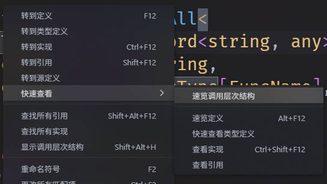

## vscode 毛玻璃主题
为你的vscode带来类似Mac OS或是Windows的acrylic material效果的菜单！

[English](README.md)
## 这本身不是一个主题，它可以与其他主题一起安装
## 预览图
 \
 \
 \
 \

## 直接安装
* 从vscode插件商店搜索Frosted Glass Theme安装
* 打开命令面板，输入“Frosted Glass Theme: Enable”，回车
* **你可以在vscode设置中改变菜单颜色等等，每次更改设置，请执行“Frosted Glass Theme: Apply Configuration”应用**
* **每次vscode或者本拓展更新，你都必须重新启用**
### 对于Linux和MacOS用户
你需要把 `window.titleBarStyle` 设置为 `custom` 。否则效果很有限。
## 或者通过Custom CSS and JS Loader拓展安装
* 下载本仓库 `inject/` 文件夹下的文件
* 根据"Custom CSS and JS Loader"拓展页面上的指示安装
* 你可以修改文件中的变量来修改主题
## 已知问题
* 如果动画闪烁，尝试设置 `frosted-glass-theme.animation` 为 `none`
## 感谢
* [be5invis/vscode-custom-css](https://github.com/be5invis/vscode-custom-css)