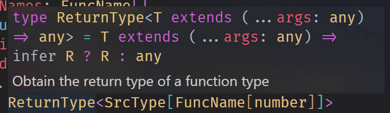

## vscode-frosted-glass-theme
Bring frosted glass menu (like windows acrylic or mac os) to your vscode!
## Preview



## Installation
* Install "Custom CSS and JS Loader" extension
* git clone this repo
* In settings, add
    ```
    "vscode_custom_css.imports":[ 
        "file:///your/path/to/vscode-frosted-glass-theme.css",
        "file:///your/path/to/vscode-frosted-glass-theme.js"
    ]
    ```
* shift + ctrl + p to open command panel
* Type in "reload custom css and js", press enter, then restart according to instruction
* It should be working. You should have seen translucent effect on menu
* You can change menu color by modifying "--background-color" in vscode-frosted-glass-theme.css file
## Known issues
* Some sub menu may not display normally.
* Sometimes UI interface may be dislocation, try comment out "--transition" in css 