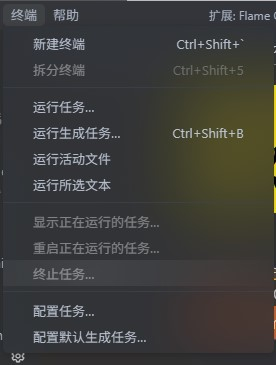

## vscode 毛玻璃主题
为你的vscode带来类似Mac OS或是Windows的acrylic material效果的菜单！
## 预览图





## 安装
* 安装"Custom CSS and JS Loader"拓展
* git clone本repo
* 在设置中添加
    ```
    "vscode_custom_css.imports":[ 
        "file:///your/path/to/vscode-frosted-glass-theme.css",
        "file:///your/path/to/vscode-frosted-glass-theme.js"
    ]
    ```
* shift + ctrl + p 呼出命令面板
* 输入reload custom css and js, 回车，根据提示重启vscode
* 应该已经生效，应该可以看到菜单变成毛玻璃的效果
* 你可以根据自己的主题修改vscode-frosted-glass-theme.css文件中--background-color来修改菜单的颜色
## 已知问题
* 部分子菜单无法显示
* 有时候界面可能会发生错位，如果发生请注释掉css中--transition